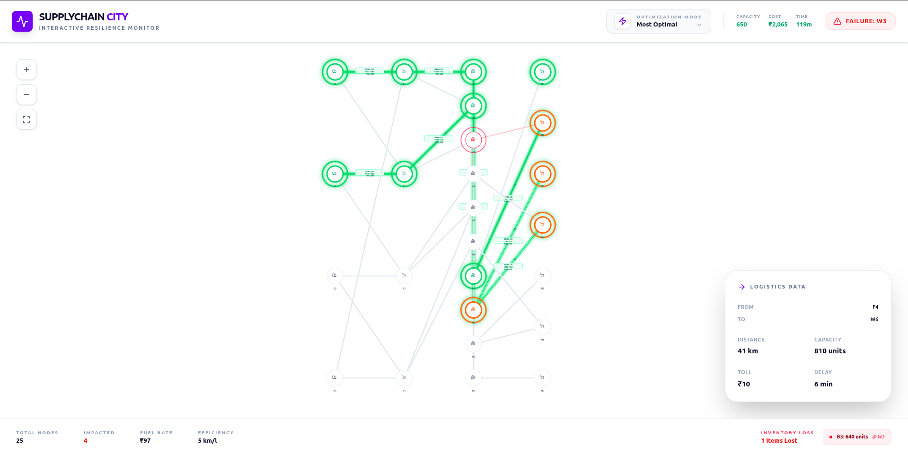
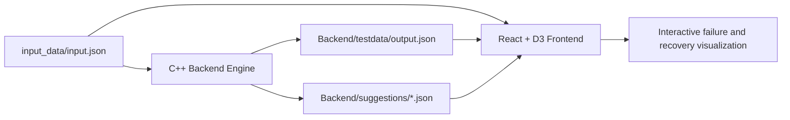

# Supply Chain Optimization

**Resilience-focused supply-chain simulation and visualization** — run failure scenarios in a C++ backend engine, generate optimized recovery plans, and inspect outcomes in a React + D3 dashboard.

[](https://github.com/omkhalane/Supply-chain-optimization/actions/workflows/ci.yml)
[](LICENSE)

## What this repository does

This project has two tightly-coupled parts:

1. **C++ backend engine**
   - Loads scenario data from `input_data/input.json`
   - Builds a directed supply network graph
   - Simulates a failure at `simulation.failureNode`
   - Computes downstream disruption with BFS
   - Calculates inventory loss for offline nodes
   - Finds recovery routes using:
     - **Most Optimal** (composite score)
     - **Max Supply** (widest path / bottleneck capacity)
     - **Min Cost**
     - **Min Time**
     - **Run All**
   - Writes outputs to disk:
     - `Backend/testdata/output.json`
     - `Backend/suggestions/most_optimal.json`
     - `Backend/suggestions/max_supply.json`
     - `Backend/suggestions/min_cost.json`
     - `Backend/suggestions/min_time.json`

2. **React + D3 frontend (Vite + TypeScript)**
   - Reads the input scenario plus backend-generated JSON files
   - Visualizes network topology, failure impact, and strategy results
   - Highlights recovery paths, metrics, and latest inventory-loss report

> The integration is **file-based**. The backend writes JSON under `Backend/`, and the frontend reads those files directly. There is no backend API server.

## Architecture at a glance



For detailed architecture notes, see [ARCHITECTURE.md](ARCHITECTURE.md).

## Quickstart

### 1) Prerequisites
- C++ compiler (`g++`, C++11+)
- Node.js 18+
- npm

### 2) Run end-to-end (recommended)

```bash
./run.sh
```

This script compiles and runs the backend, then starts the frontend if strategy outputs exist.

### 3) Run with a specific scenario

```bash
./use_case.sh --list
./use_case.sh case_simple_linear.json
```

### 4) Choose strategy in backend prompt
When asked, choose:
1. Most Optimal
2. Max Supply
3. Min Cost
4. Min Time
5. Run All

For full setup and usage instructions:
- [SETUP.md](SETUP.md)
- [USAGE.md](USAGE.md)

## Optimization strategies and generated outputs

- **Most Optimal**: best composite score route
- **Max Supply**: route with maximum bottleneck capacity
- **Min Cost**: least total route cost
- **Min Time**: fastest route
- **Run All**: executes all four strategies and writes all four suggestion files

Generated artifacts:

- Inventory loss history (append-style):
  - `Backend/testdata/output.json`
- Strategy suggestion files:
  - `Backend/suggestions/most_optimal.json`
  - `Backend/suggestions/max_supply.json`
  - `Backend/suggestions/min_cost.json`
  - `Backend/suggestions/min_time.json`

## Repository structure

```text
.
├── ARCHITECTURE.md
├── SETUP.md
├── USAGE.md
├── run.sh
├── use_case.sh
├── Backend/
│   ├── src/
│   │   └── main.cpp
│   ├── suggestions/      # generated at runtime
│   └── testdata/         # generated at runtime
├── Frontend/
│   ├── src/
│   └── package.json
├── input_data/
│   ├── input.json
│   ├── template.json
│   └── case_*.json
└── assets/
    └── image.png
```

## Screenshots

- Dashboard hero image: `assets/image.png`

## Troubleshooting

### 1) Frontend shows missing data / no strategy results
- Ensure backend was run and produced JSON files in `Backend/suggestions/` and `Backend/testdata/output.json`.
- If no routes are possible for the scenario, `run.sh` intentionally skips frontend startup.

### 2) Backend reports no valid recovery routes
- The selected failure scenario may fully disconnect required paths.
- Try another scenario from `input_data/case_*.json` or run with strategy **5 (Run All)** for comparison.

### 3) Frontend does not start
- Install dependencies in `Frontend/`:
  ```bash
  cd Frontend
  npm install
  npm run dev
  ```
- Ensure Node.js version is compatible (18+).

## Contributing

Contributions are welcome. Please read [CONTRIBUTING.md](CONTRIBUTING.md) before submitting changes.

## License

This project is licensed under the terms in [LICENSE](LICENSE).
